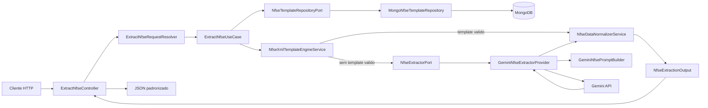

# Arquitetura do Projeto

## Visão geral

Esta POC foi estruturada para validar a extração de dados de NFS-e com IA sem acoplar a aplicação a um layout específico, a um fornecedor específico ou ao framework web.

O fluxo atual é híbrido:

- primeiro tenta extração por template XPath no MongoDB por `codigo_municipio`;
- quando não há template válido, faz fallback para Gemini;
- no fallback, persiste um novo template para reduzir custo/token nas próximas requisições.

O desenho adotado combina DDD e Arquitetura Hexagonal:

- DDD para manter o foco no problema de negócio: extrair, normalizar e evoluir a validação de documentos fiscais de serviço.
- Hexagonal para isolar o núcleo da aplicação dos adaptadores de entrada e saída, como HTTP, MongoDB e Gemini.

Hoje o projeto ainda convive com um scaffold inicial de exemplo (`/api/hello`), mas a POC real está centrada no fluxo de extração de NFS-e exposto em `POST /api/extract`.

## Organização em camadas

### Domain

Concentra regras de negócio que devem permanecer independentes de framework, transporte e fornecedor externo.

Responsabilidades atuais:

- normalizar dados extraídos de layouts heterogêneos em um contrato único;
- consolidar nomes de campos equivalentes;
- converter valores textuais em tipos esperados, como números e textos opcionais;
- aplicar templates XPath sobre XML e construir rascunho de template para novos layouts.

Principais componentes atuais:

- `Domain/Service/NfseDataNormalizerService`
- `Domain/Service/NfseXmlTemplateEngineService`

### Application

Orquestra os casos de uso e define os contratos que o núcleo espera dos adaptadores externos.

Responsabilidades atuais:

- receber XML e `codigo_municipio` como entrada de caso de uso;
- consultar templates por município por meio de porta dedicada;
- acionar uma porta de extração sem conhecer a implementação concreta;
- devolver um DTO de saída com o payload padronizado.

Principais componentes atuais:

- `Application/UseCase/ExtractNfseUseCase`
- `Application/Port/NfseExtractorPort`
- `Application/Port/NfseTemplateRepositoryPort`
- `Application/Dto/NfseExtractionOutput`

### Infrastructure

Implementa as portas definidas pela aplicação e concentra os detalhes técnicos de integração com recursos externos.

Responsabilidades atuais:

- armazenar e buscar templates de extração por município no MongoDB;
- montar prompt do Gemini com contrato explícito de saída (incluindo `xpaths` por campo);
- chamar a API REST do modelo configurado;
- tratar erros de comunicação e converter a resposta para estrutura PHP.

Principais componentes atuais:

- `Infrastructure/Provider/GeminiNfseExtractorProvider`
- `Infrastructure/Provider/GeminiNfsePromptBuilder`
- `Infrastructure/Repository/MongoNfseTemplateRepository`

### EntryPoint

Representa os adaptadores de entrada. No momento, a interface pública principal é HTTP.

Responsabilidades atuais:

- receber upload ou corpo XML bruto;
- resolver e validar `codigo_municipio`;
- validar formato básico do XML;
- chamar o caso de uso adequado;
- traduzir sucesso e falha para respostas HTTP.

Principais componentes da POC:

- `EntryPoint/Api/Controller/ExtractNfseController`
- `EntryPoint/Api/Resolver/ExtractNfseRequestResolver`

## Fluxo ponta a ponta da POC

## Onde a Hexagonal aparece nesta POC

A Arquitetura Hexagonal está refletida na separação entre portas e adaptadores:

- `NfseExtractorPort` define o contrato esperado pelo caso de uso;
- `NfseTemplateRepositoryPort` define o contrato de persistência/consulta de templates;
- `GeminiNfseExtractorProvider` implementa a extração por IA;
- `MongoNfseTemplateRepository` implementa a persistência de templates;
- `ExtractNfseController` atua como adaptador de entrada HTTP.

Essa separação traz ganhos diretos:

1. troca de provider sem reescrever o caso de uso;
2. entrada futura por fila, CLI ou processamento em lote sem reescrever o núcleo;
3. evolução para OCR/PDF como novo adaptador, preservando o desenho central;
4. otimização de custo/token pela reutilização de templates por município.

## Inversão de dependência e configuração

O container do Symfony liga contratos a implementações concretas em `config/services.yaml`.

Mapeamentos relevantes hoje:

- `MsNfseParser\Application\Port\NfseExtractorPort` -> `MsNfseParser\Infrastructure\Provider\GeminiNfseExtractorProvider`
- `MsNfseParser\Application\Port\NfseTemplateRepositoryPort` -> `MsNfseParser\Infrastructure\Repository\MongoNfseTemplateRepository`
- `MsNfseParser\Application\Port\GreetingProviderPort` -> `MsNfseParser\Infrastructure\Provider\StaticGreetingProvider`

No ambiente de teste, `config/services_test.yaml` substitui a porta de extração e o repositório de templates por doubles/in-memory para evitar chamadas externas reais.

## Rotas

As rotas são carregadas por atributos a partir de `src/EntryPoint/Api/Controller/`.

Endpoints atuais:

- `POST /api/extract`: fluxo principal da POC (XML + `codigo_municipio` obrigatório)
- `GET /api/hello`: endpoint auxiliar do scaffold inicial

## Estratégia de testes

A cobertura atual reforça a separação entre núcleo e adaptadores:

- `tests/unit/application/UseCase/ExtractNfseUseCaseTest.php`: valida a orquestração do caso de uso
- `tests/integration/api/NfseExtractApiTest.php`: valida o contrato HTTP da extração
- `tests/unit/domain/Service/GreetingServiceTest.php` e `tests/unit/application/UseCase/GetHelloWorldUseCaseTest.php`: preservam o scaffold inicial de exemplo

## Evolução prevista

As próximas evoluções mais coerentes com o desenho atual são:

- adicionar versionamento de templates por município;
- introduzir validação cruzada entre XML e PDF com OCR;
- enriquecer o domínio com objetos de valor e regras de comparação documental;
- formalizar melhor tratamento de erros, níveis de confiança e governança de templates.
