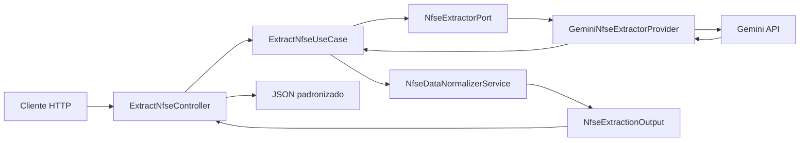

# Arquitetura do Projeto

## Visão geral

Esta POC foi estruturada para validar a extração de dados de NFS-e com IA sem acoplar a aplicação a um layout específico, a um fornecedor específico ou ao framework web.

O desenho adotado combina DDD e Arquitetura Hexagonal:

- DDD para manter o foco no problema de negócio: extrair, normalizar e evoluir a validação de documentos fiscais de serviço.
- Hexagonal para isolar o núcleo da aplicação dos adaptadores de entrada e saída, como HTTP, Gemini e futuros mecanismos de OCR.

Hoje o projeto ainda convive com um scaffold inicial de exemplo (`/api/hello`), mas a POC real está centrada no fluxo de extração de NFS-e exposto em `POST /api/extract`.

## Organização em camadas

### Domain

Concentra regras de negócio que devem permanecer independentes de framework, transporte e fornecedor externo.

No estado atual da POC, o domínio está mais orientado a serviços do que a padrões táticos completos de DDD, o que é coerente com o estágio exploratório do projeto.

Responsabilidades atuais:

- normalizar dados extraídos de layouts heterogêneos em um contrato único;
- consolidar nomes de campos equivalentes;
- converter valores textuais em tipos esperados, como números e textos opcionais.

Principal componente atual:

- `Domain/Service/NfseDataNormalizerService`

Esse serviço funciona como a regra central de uniformização da POC: a IA pode variar na forma de responder, mas o domínio tenta estabilizar a saída consumida pelo restante do sistema.

### Application

Orquestra os casos de uso e define os contratos que o núcleo espera dos adaptadores externos.

Responsabilidades atuais:

- receber o XML como entrada de caso de uso;
- acionar uma porta de extração sem conhecer a implementação concreta;
- devolver um DTO de saída com o payload padronizado.

Principais componentes atuais:

- `Application/UseCase/ExtractNfseUseCase`
- `Application/Port/NfseExtractorPort`
- `Application/Dto/NfseExtractionOutput`

O ponto principal aqui é a inversão de dependência: o caso de uso depende de uma porta, não do Gemini diretamente.

### Infrastructure

Implementa as portas definidas pela aplicação e concentra os detalhes técnicos de integração com recursos externos.

Responsabilidades atuais:

- montar o prompt enviado ao Gemini;
- chamar a API REST do modelo configurado;
- tratar erros de comunicação e converter a resposta para estrutura PHP.

Principal componente atual:

- `Infrastructure/Provider/GeminiNfseExtractorProvider`

Essa escolha permite trocar o provider de IA no futuro sem alterar o caso de uso principal, desde que a nova integração implemente a mesma porta.

### EntryPoint

Representa os adaptadores de entrada. No momento, a interface pública principal é HTTP.

Responsabilidades atuais:

- receber upload ou corpo XML bruto;
- validar formato básico do XML;
- chamar o caso de uso adequado;
- traduzir sucesso e falha para respostas HTTP.

Principal componente da POC:

- `EntryPoint/Api/Controller/ExtractNfseController`

O diretório também contém um endpoint simples de scaffold (`HelloWorldController`) mantido como base inicial do projeto, mas ele não representa o fluxo principal da POC.

## Fluxo ponta a ponta da POC

## Onde DDD aparece nesta POC

O uso de DDD aqui é estratégico, não dogmático. A POC ainda não tem entidades, agregados ou objetos de valor modelados de forma ampla, porque o foco atual é validar a viabilidade do fluxo de extração.

Mesmo assim, os princípios de DDD já orientam o desenho:

- o problema central é documental/fiscal, não tecnológico;
- o núcleo da aplicação fica separado do provider de IA e do framework;
- a linguagem do projeto caminha para conceitos do domínio, como extração, normalização, NFS-e, prestador, tomador e totais.

Se a POC evoluir para conciliação entre XML e PDF, validação de divergências e regras fiscais mais sofisticadas, o caminho natural é enriquecer o domínio com objetos de valor, políticas e serviços mais especializados.

## Onde a Hexagonal aparece nesta POC

A Arquitetura Hexagonal está refletida na separação entre portas e adaptadores:

- `NfseExtractorPort` define o contrato esperado pelo caso de uso;
- `GeminiNfseExtractorProvider` implementa esse contrato como adaptador de saída;
- `ExtractNfseController` atua como adaptador de entrada HTTP.

Essa separação traz ganhos diretos:

1. troca de provider sem reescrever o caso de uso;
2. entrada futura por fila, CLI ou processamento em lote sem reescrever o núcleo;
3. evolução para OCR/PDF como novo adaptador, preservando o desenho central.

## Por que Symfony

Symfony foi escolhido porque oferece container, roteamento, configuração explícita e integração com testes sem impor que a regra de negócio viva dentro do framework.

Neste projeto, ele funciona como fundação técnica e mecanismo de composição, não como centro da aplicação. Isso reduz atrito ao organizar o código em domínio, aplicação e adaptadores.

Essa característica foi determinante para a escolha frente ao Laravel. Embora Laravel seja produtivo, ele costuma induzir mais fortemente determinadas convenções de organização e fluxo. Para esta POC, a necessidade principal era liberdade para proteger o núcleo do negócio sem disputar com a estrutura do framework.

## Inversão de dependência e configuração

O container do Symfony liga contratos a implementações concretas em `config/services.yaml`.

Mapeamentos relevantes hoje:

- `MsNfseParser\Application\Port\NfseExtractorPort` -> `MsNfseParser\Infrastructure\Provider\GeminiNfseExtractorProvider`
- `MsNfseParser\Application\Port\GreetingProviderPort` -> `MsNfseParser\Infrastructure\Provider\StaticGreetingProvider`

No ambiente de teste, `config/services_test.yaml` substitui a porta de extração por um double para evitar chamadas reais ao Gemini.

## Rotas

As rotas são carregadas por atributos a partir de `src/EntryPoint/Api/Controller/`.

Endpoints atuais:

- `POST /api/extract`: fluxo principal da POC
- `GET /api/hello`: endpoint auxiliar do scaffold inicial

## Estratégia de testes

A cobertura atual reforça a separação entre núcleo e adaptadores:

- `tests/unit/application/UseCase/ExtractNfseUseCaseTest.php`: valida a orquestração do caso de uso
- `tests/integration/api/NfseExtractApiTest.php`: valida o contrato HTTP da extração
- `tests/unit/domain/Service/GreetingServiceTest.php` e `tests/unit/application/UseCase/GetHelloWorldUseCaseTest.php`: preservam o scaffold inicial de exemplo

Esse arranjo deixa claro que a POC já testa seu fluxo principal sem depender de chamadas externas reais.

## Evolução prevista

As próximas evoluções mais coerentes com o desenho atual são:

- adicionar novos adaptadores de extração além do Gemini;
- introduzir validação cruzada entre XML e PDF com OCR;
- enriquecer o domínio com objetos de valor e regras de comparação documental;
- formalizar melhor tratamento de erros e níveis de confiança retornados pela IA.
