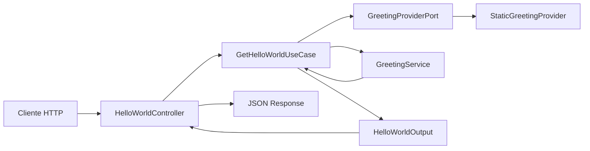

# Arquitetura do Projeto

## Visao geral

Este projeto segue uma organizacao em camadas inspirada em Clean Architecture, separando responsabilidades para facilitar manutencao, testes e evolucao.

A estrutura principal esta dividida em:

- `Domain`: regras de negocio puras e servicos de dominio.
- `Application`: casos de uso, portas e DTOs de saida.
- `Infrastructure`: implementacoes concretas de dependencias externas.
- `EntryPoint`: interface de entrada HTTP (controllers).

## Camadas e responsabilidades

### Domain

Contem a regra de negocio central sem dependencia de framework.

- Classe principal atual: `GreetingService`
- Responsabilidade: montar a mensagem final de saudacao com base no cumprimento e no nome informado.

Exemplo de regra:

- Se o nome vier vazio, retorna "Hello, world!".
- Se o nome vier preenchido, retorna "Hello, <nome>!".

### Application

Orquestra o fluxo da aplicacao e define contratos.

- `UseCase/GetHelloWorldUseCase`: executa o caso de uso de saudacao.
- `Port/GreetingProviderPort`: contrato para obter o cumprimento base.
- `Dto/HelloWorldOutput`: formato de saida da camada de aplicacao.

Fluxo interno do caso de uso:

1. Solicita o cumprimento base via `GreetingProviderPort`.
2. Delegada a composicao da mensagem para `GreetingService` (dominio).
3. Retorna o resultado encapsulado em `HelloWorldOutput`.

### Infrastructure

Implementa os contratos definidos na camada de aplicacao.

- `Provider/StaticGreetingProvider`: implementa `GreetingProviderPort` retornando "Hello".

Essa camada pode ser substituida por outras implementacoes no futuro (ex.: provider configuravel por banco, API externa ou arquivo).

### EntryPoint

Recebe a requisicao HTTP e aciona o caso de uso.

- `Api/Controller/HelloWorldController`
- Rota: `GET /api/hello`
- Parametro esperado: `name` (query string, opcional)

Responsabilidades do controller:

1. Ler entrada da requisicao.
2. Chamar `GetHelloWorldUseCase`.
3. Serializar o resultado em JSON.

## Fluxo ponta a ponta

## Inversao de dependencia e DI

A configuracao de servicos utiliza autowire/autoconfigure do Symfony.

Mapeamento de contrato para implementacao:

- `MsNfseParser\Application\Port\GreetingProviderPort`
- Resolvido para: `MsNfseParser\Infrastructure\Provider\StaticGreetingProvider`

Esse mapeamento permite trocar implementacoes sem alterar o caso de uso.

## Rotas

As rotas de API sao carregadas por atributos no diretorio de controllers de API.

- Recurso configurado: `src/EntryPoint/Api/Controller/`
- Tipo: `attribute`

## Testes

A base de testes inclui:

- Unitario de dominio (`GreetingServiceTest`): valida regras de negocio.
- Unitario de aplicacao (`GetHelloWorldUseCaseTest`): valida orquestracao do caso de uso.
- Integracao de API (`HelloWorldApiTest`): valida endpoint HTTP e payload.

Essa distribuicao reforca a separacao de responsabilidades:

- Regras criticas ficam protegidas por testes unitarios rapidos.
- Contrato HTTP e integracao com framework ficam cobertos por teste de integracao.

## Decisoes arquiteturais atuais

- Framework web: Symfony.
- Estilo arquitetural: camadas com foco em separacao de dominio/aplicacao/infraestrutura.
- Contratos em `Application/Port` para reduzir acoplamento com implementacoes concretas.
- DTO de saida para explicitar fronteira do caso de uso.

## Proximos passos sugeridos para evolucao

- Adicionar adaptadores de infraestrutura alternativos para `GreetingProviderPort`.
- Expandir camada de dominio com objetos de valor quando surgirem regras mais complexas.
- Introduzir padrao de tratamento de erros de aplicacao (ex.: excecoes de caso de uso + mapeamento HTTP).
- Padronizar resposta de API com envelope comum para metadados e erros.
